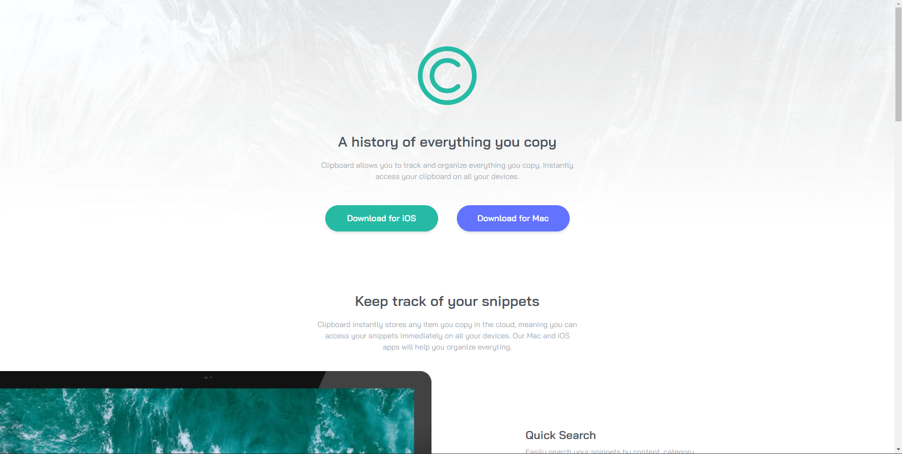
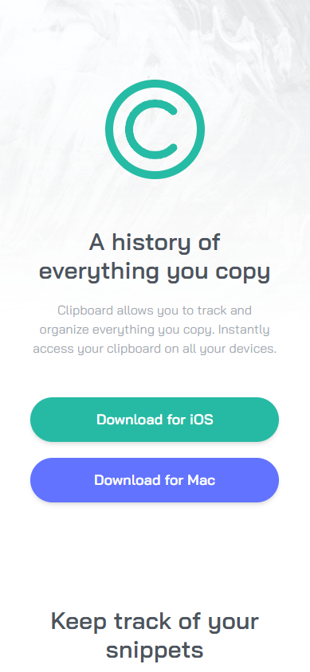

# Frontend Mentor - Advice generator app

This is a solution to the [Clipboard Landing Page](https://www.frontendmentor.io/challenges/clipboard-landing-page-5cc9bccd6c4c91111378ecb9). Frontend Mentor challenges help you improve your coding skills by building realistic projects. 

## Table of contents
- [Overview](#overview)
  - [Screenshot](#screenshot)
  - [Links](#links)
- [My process](#my-process)
  - [Built with](#built-with)
  - [What I learned](#what-i-learned)
  - [Continued development](#continued-development)
  - [Useful resources](#useful-resources)
- [Author](#author)
- [Acknowledgments](#acknowledgments)

## Overview
This repository contains my personal solution for [Clipboard Landing Page](https://www.frontendmentor.io/challenges/clipboard-landing-page-5cc9bccd6c4c91111378ecb9).

If there's any input/advice/recommendation that you want to add. Please send your comment in the issues tab.

Thank you! 🙏

### Screenshot

Desktop Screenshot:

Mobile Screenshot:

### Links

- Solution URL: [GitHub Solution URL here](https://github.com/farrel-hi/clipboard-landing-page-react)
- Live Site URL: [Live site URL here](https://farrel-hi.github.io/clipboard-landing-page-react/)

## My process
1. Create the Necessary Components and add HTML semantic structure first
2. Create the mobile rules first as the default rules and then the desktop rules second using Tailwind CSS

### Built with

- Semantic HTML5 markup
- Tailwind CSS default properties with a few custom properties
- JavaScript Function
- Flexbox

### What I learned

Here are the things that i learn:
1. Learn how to use Tailwind CSS
2. Remembering the Basic of React

### Continued development

I would like to continue develop my skill as a whole through projects from [Frontend Mentor](https://www.frontendmentor.io/).

### Useful resources

- [W3School](https://www.w3schools.com/)
- [Tailwind CSS](https://tailwindcss.com/)
- [HTML Documentation](https://developer.mozilla.org/en-US/docs/Web/HTML)

## Author

- Frontend Mentor - [@farrel-hi](https://www.frontendmentor.io/profile/farrel-hi)

## Acknowledgments
